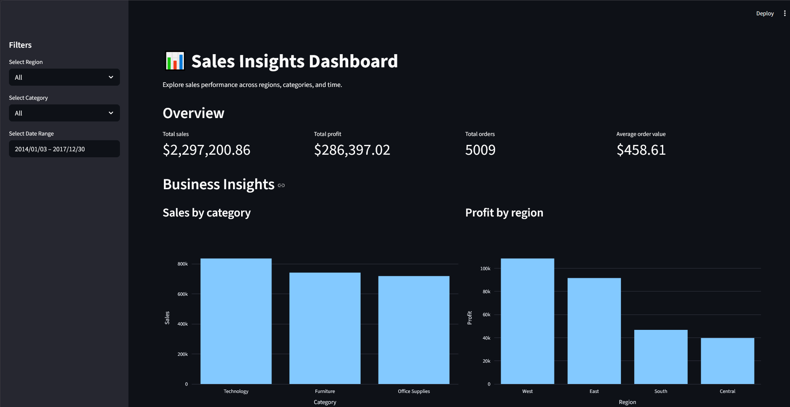
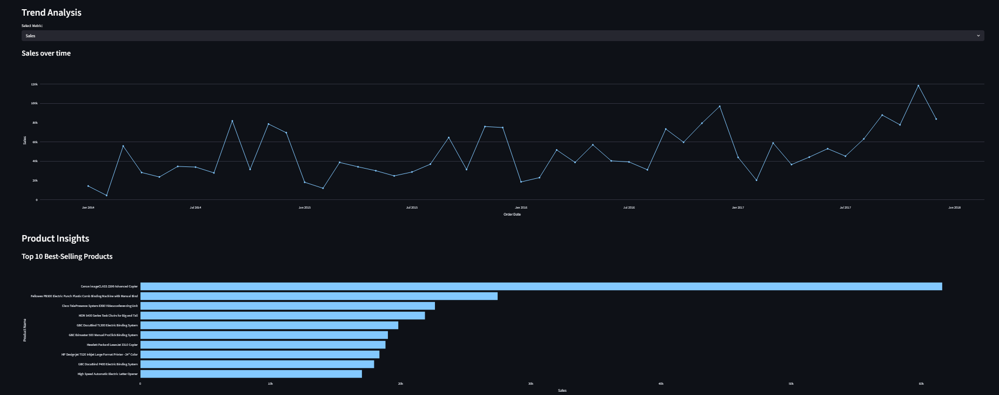
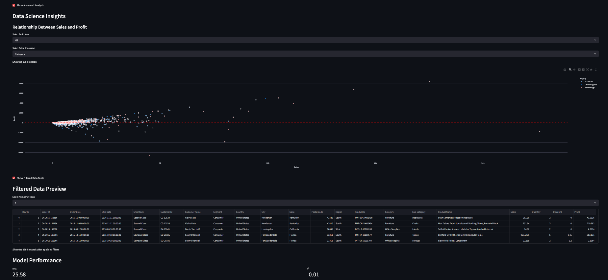

# Sales Insights Dashboard

An interactive Data Science application built with Streamlit for exploring and analyzing sales data.

The dashboard allows users to examine key business metrics, sales trends, and performance across categories and regions using interactive filters and visualizations.

It also includes a simple machine learning module for profit prediction, combining data exploration with predictive analytics in a single application.

The project is designed as a portfolio-ready analytical application and can be deployed online.

## Features

- Interactive sidebar filters for region, category, and date range selection
- KPI overview with total sales, total profit, total orders, and average order value
- Interactive visualizations for business insights and sales trend analysis
- Product performance analysis with a Top 10 best-selling products chart
- Advanced scatter plot analysis for exploring the relationship between sales and profit
- Built-in machine learning module for profit prediction

## Tech Stack

- **Python** – core programming language used to build the application
- **Streamlit** – framework for creating the interactive dashboard interface
- **Pandas** – data loading, cleaning, filtering, and transformation
- **Plotly Express** – interactive data visualizations
- **scikit-learn** – machine learning model training and evaluation

## Machine Learning

The application includes a simple machine learning module for predicting **Profit** based on selected sales-related features.

### Target Variable
- **Profit**

### Input Features
- Sales
- Quantity
- Discount
- Category
- Region
- Sub-Category
- Segment

### Model
- **RandomForestRegressor**

### Evaluation Metrics
- **MAE (Mean Absolute Error):** average prediction error in profit units
- **R² Score:** measures how well the model explains the variance in the target variable

### Notes
The model is intended as a portfolio demonstration of integrating machine learning into an interactive analytical application.  
It is not optimized for production use, but it shows the complete workflow:
data preparation, encoding categorical features, model training, evaluation, and user-driven prediction inside the dashboard.

## Project Structure

```text
sales_dashboard_app/
│
├── app.py
├── data/
│   └── sales.csv
├── README.md
└── requirements.txt
```

## How to Run

1. Clone the repository:
   ```bash
   git clone https://github.com/NobertSolkiewicz/sales-insights-dashboard.git
   cd data
   ```
   
2. Create and activate a virtual environment:
   ``` python -m venv .venv 
   ```

### Windows
```.venv\Scripts\activate```

### macOS/Linux
```source .venv/bin/activate```

3. Install dependencies:
```pip install -r requirements.txt```

4. Run the Streamlit application:
```streamlit run app.py```

## What I Learned

Through this project, I learned how to:

- build interactive analytical applications with Streamlit
- design dashboards that combine filters, KPIs, and visualizations
- work with Pandas for data preparation and transformation
- create interactive charts with Plotly Express
- improve dashboard usability through better layout and interactivity
- integrate a simple machine learning model into a data application
- prepare user input for prediction using encoding and feature alignment
- structure code more clearly through refactoring and helper functions

## Future Improvements

Possible future improvements for this project include:

- improving the machine learning model and comparing multiple algorithms
- adding better feature engineering and model tuning
- linking sub-categories dynamically to the selected category in the prediction form
- enhancing the dashboard layout and visual styling
- adding model explainability or feature importance analysis
- deploying the application online with Streamlit Community Cloud
- adding screenshots, demo links, and project documentation for portfolio presentation


## File Overview
- app.py – main Streamlit application with dashboard logic, visualizations, and machine learning module
- data/sales.csv – dataset used for analysis and prediction
- README.md – project description, setup instructions, and documentation
- requirements.txt – list of required Python packages

## Screenshots

### Dashboard Overwiev


### Trend Analysis and Product Insights


### Machine Learning Prediction Module


## Notes
The model is included as a learning-focused proof of concept rather than a production-ready forecasting solution.